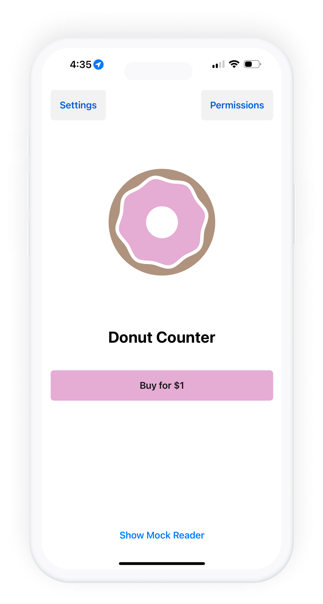
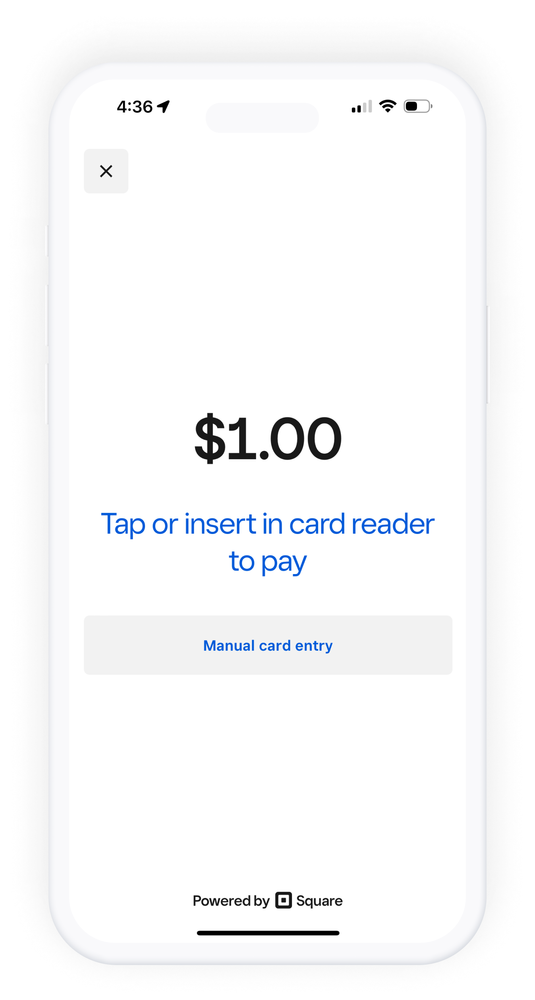
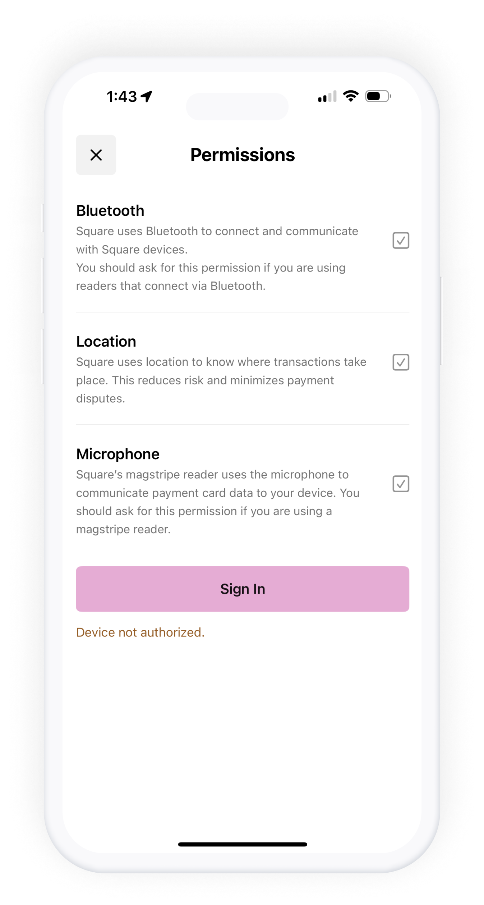
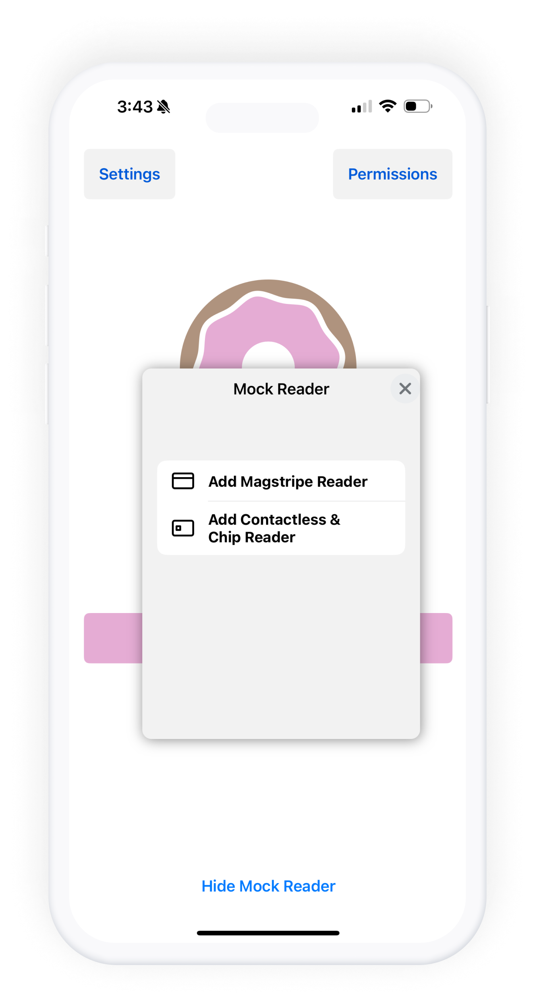
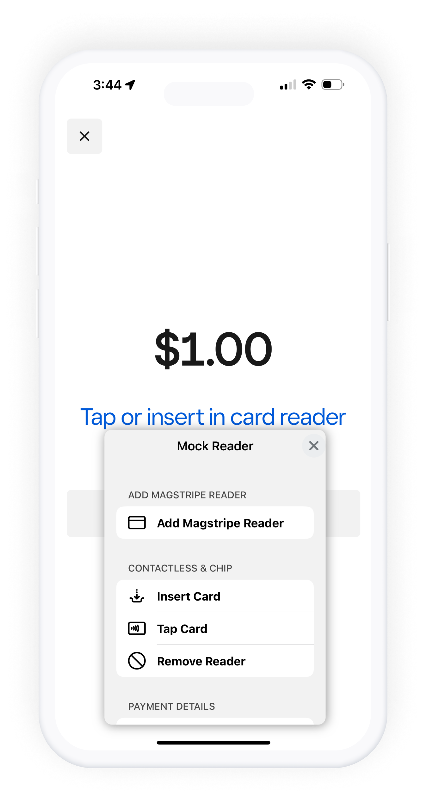

# 🍩 Donut Counter - A Square Mobile Payments SDK Sample App

 

Donut Counter is a sample application for building with the [Square Mobile Payments SDK](https://developer.squareup.com/docs/mobile-payments-sdk) on iOS. The app demonstrates how to install and initialize the SDK in a SwiftUI project as well as utilizing the APIs and user interfaces provided by the SDK to authorize a merchant, pair and manage card readers, and take a payment. To get started, follow the steps below.

## SDK Quick Reference

| Reference                        | Sample App Project Location                   |
| -------------------------------- | ----------------------------------------- |
| ⚡️ Initializing the SDK          | [DonutCounter/DonutCounterApp.swift](./DonutCounter/DonutCounter/DonutCounterApp.swift#L15) |
| 🔒 Authorizing the SDK           | [DonutCounter/Screens/Permissions/PermissionsView.swift](./DonutCounter/DonutCounter/Screens/Permissions/PermissionsView.swift#L192-L207) |
| 💰 Taking a Payment              | [DonutCounter/Screens/Home/HomeView.swift](./DonutCounter/DonutCounter/Screens/Home/HomeView.swift#L155-L182) |
| ⚙️ Presenting Settings Screen    | [DonutCounter/Screens/Home/HomeView.swift](./DonutCounter/DonutCounter/Screens/Home/HomeView.swift#L128-L136) |
| 💳 Presenting MockReaderUI       | [DonutCounter/Screens/Home/HomeView.swift](./DonutCounter/DonutCounter/Screens/Home/HomeView.swift#L210-L228) |

# Get Started

## 1. Review requirements

### Assumptions
The example app makes the following assumptions:

* You have read the [Mobile Payments SDK "Build on iOS"](https://developer.squareup.com/docs/mobile-payments-sdk/ios) documentation. The example app focuses on demonstrating how the Square Mobile Payments SDK works by using all of the provided user interfaces of the SDK.
* You have a Square account enabled for payment processing. If you have not
  enabled payment processing on your account (or you are not sure), visit
  [squareup.com/activate](https://squareup.com/activate).

### Prerequisites

* Confirm your environment meets the Square Mobile Payments SDK build requirements listed in the [root README](../README.md) for this repo.
* Clone this repo (if you have not already):
  `git clone https://github.com/square/mobile-payments-sdk-ios`

## 2. Get application credentials
In your [Developer Dashboard](https://developer.squareup.com/apps), create an application or open an existing one you would like to use. If this is your first time creating an application with Square, you can review this [Get Started](https://developer.squareup.com/docs/square-get-started) guide for more information.

On the application's Credentials page, toggle the environment you'd like to use at the top (Production/Sandbox). Sandbox credentials will allow you to take mock payments with a mock reader. Make note of:
* **Application ID**
* **Access Token**

Click "Locations" in the left navigation and make note of the Default Test Account's **Location ID** as well. These values will be used in the next step.

## 3. Configure the SDK
In the [Config.swift](./Shared/Config.swift) file, populate the values for Square application id, access token, and location id you obtained from the previous step.

## 4. Run the app
1. Open `DonutCounter.xcodeproj` in Xcode
2. Select the `DonutCounter` target found at the top of Xcode.
3. Select your desired device and click the Run button.

## 5. Request required permissions
On the first install of the application, you will be required to grant various device permissions in order for the SDK to be fully functional.

Tap the 'Permissions' button found on the top right of the home view. Tap the empty checkbox next to each permission to grant the specific device permission. The checkbox will update with a checkmark if the proper permission is granted. All permissions must be granted.

## 6. Authorize the SDK
Within the Permissions screen, you will find a `Sign In` button. Tap this button to authorize the sdk with the credentials you provided in Step 3. If an issue occurs during authorization, check the Xcode console for a log with the specific authorization error. You will know the SDK is fully authorized when the button updates to `Sign Out` and the text below the button reads `The device is authorized`.

## 7. Pair a reader
Depending on what environment you are authorized in, the steps for pairing a reader will differ. Follow the steps below according to your current environment.

### Production
In a production environment, you are only able to pair actual Square card readers. Mock readers do not work in a production environment.

To pair a reader:
1. Tap the `Settings` button found in the top left corner of the application. This will display the Square provided settings screen allowing you to manage and pair readers.
2. Tap the "Pair a reader" button.
3. Follow the instructions on the dialog that present on how to pair your contactless reader to your device.
4. After a successful pair, you should see the reader available in the `Devices` tab of the settings screen.
5. The reader is ready to be used for payments once the state updates to `Ready`.

### Sandbox
In a sandbox environment, you are only able to add mock readers utilizing the `MockReaderUI` framework. The `MockReaderUI` framework is provided as a part of this repo and has already been added to the DonutCounter app. Please note that MockReaderUI is to only be used in debug builds of your application, not in a production application.

To pair a mock reader:
1. Once the SDK has been authorized in sandbox, navigate back to the main home view of the app.
2. On the bottom of the main donut counter app view, tap the button `Show Mock Reader`
3. A reader shaped button should appear on the screen. This button can be placed anywhere on the screen by holding down the button and dragging around the screen.
4. Tapping on the button should reveal a menu to add a mock magstripe or contactless & chip reader.
5. Tap on the reader type you'd like to connect. You can verify the mock reader has been added correctly in the Settings screen.

## 8. Take a Payment

To process a payment, follow these steps:

1. On the main screen of the application, tap the "Buy for $1" button. This action will present the default payment prompt screen provided by the SDK.

2. Depending on your environment:
   - **Production Environment**: Use your paired Square reader to tap, insert, or swipe a payment card.
   - **Sandbox Environment**: Tap the mock reader button and choose an option to tap, insert, or swipe a mock payment card.

